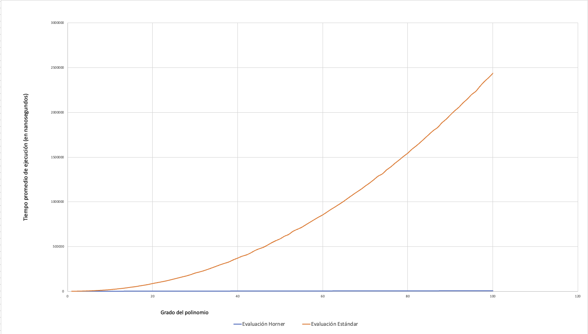

# Evaluacion-de-Polinomios

## Resumen

El siguiente programa en cuestión tiene como objetivo hacer una comparación entre dos de los métodos más comúnes—y altamente diferentes entre sí—para mostrar de forma más evidente sus níveles de eficiencia al realizar evaluaciones con polinomios. Al ser ejecutado, el programa incrementa el grado de los polinomios de 10 en 10 empezando desde 10 hasta un grado 1000 [datos los cuales pueden ser modificados]. Los valores que los coeficientes acompañados por los grados pueden tomar se encuentra en un rango de [-10,10] al igual que los valores en los que estos mismo son evaluados. Para demostrar más a fondo tal diferencia en eficiencia, se toma también el tiempo por medio de un cronómetro en el cual ocurren tales evaluaciones y consecuentemente ilustrados por medio de una gráfica. 

## Requisitos del Sistema

Los requisitos del sistema son los siguientes: 

C++ Executable en la versión C++ 20 estándar. Las librerías necesarias para su ejecución están ya descritas en el archivo principal del programa y las cuales son accesibles y aptas para correr tanto en macOS, Linux o Windows. Específicamente, el código fue creado y corrido en el sistema macOS Sequoia 15.3.2.

## Instrucciones de compilación y ejecución
Abajo, se adjuntan los pasos a seguir para ejecutar el código exitosamente desde una terminal de preferencia:
1.
   ```sh
   git clone https://github.com/jovannareyesc/Evaluacion-de-Polinomios
   ```
2. 
   ```sh
   cd Evaluacion-de-Polinomios
   ```
3. 
   ```sh
   g++ main.cpp -o main -std=c++20
   ```
4. 
   ```sh
   ./main
   ```

## Descripción de los algoritmos

Durante milenia, los polinomios se han desarrollado a ser parte de la vida cotidiana dentro de las culturas con mayor impacto global. Ya sea que esta implementación fuese para el beneficio de las masas por medio de la construcción de canales, estructuras metropolitanas o incluso para la creación de un sistema de calendario. Todos estos aspectos en los cuales se les encuentra cabida a los polinomios son justamente los usos que se les dieron a los polinomios en la china antigua. Gracias a que el país oriental necesitaba de un gran nivel de protección por sus incontables kilómetros cuadrados, los cálculos de polinomios necesarios para sus construcciones llegaban a ser tan grandes que—por medio de un sentimiento casi darwinista—por necesidad a realizar cálculos tan grandes, fue donde primero se vio el desarrollo de este tipo de herramientas computacionales lo suficientemente eficientes con los recursos con los que contaban. Sin embargo, este tipo de algoritmos antiguos solo cobraron reconocimiento hasta años después bajo el nombre del matemático inglés, William George Horner, quien originalmente lo habría atribuido al matemático italiano, Joseph-Louis Lagrange. El método de Horner consiste en pocas palabras, aumentar la eficiencia con la que se evalúan funciones polinómicas. Por naturaleza, e incluso si un intenta imaginar tal evaluación extensa de polinomios—tanto como para nosotros como para una computadora—este proceso llegar a ser exhausto y altamente propenso a error. Debido a esto, el método de Horner el cual está expresado en forma de un algoritmo el cual, al aprovechar la propiedad distributiva del álgebra, se organiza de tal manera que evita calcular potencias de **x** una y otra vez. Paso por paso, lo que hace es extraer los coeficientes de un polinomio para después ordenar estos en orden descendente tal que el primero en la lista (o i=[0] en un programa) sea el valor del polinomio con el menor grado, o sea, el valor c que corresponde a un coeficiente en un polinomio. Al hacer esto, lo que hace es multiplicar de forma iterativa las descomposiciones distributivas del polinomio en multiplicaciones y sumas secuenciales en x, minimizando drásticamente así, tanto el tiempo, cono el margen de error que hay al realizar una evaluación de polinomios extensa. 

## Resultados experimentales y gráfica comparativa
OJO: Cada unidad en el eje x corresponde a 10 grados.


## Análisis de resultados

Simplemente por observar la gráfica en el punto anterior, podemos observar insolentemente la diferencia en eficiencia de ambos métodos. Definitivamente, podemos concluir que el método de evaluación de polinomios de Horner es increíblemente más eficaz en todo aspecto. Como mencionado previamente, el enfoque principal del método de Horner es justamente eso: aumentar la eficiencia con la que se evalúa una suma de polinomios evaluada en cualquier número _x_. La forma estándar, aunque más intuitiva y "fácil", se arrastra por detrás de su contricante el cual ni siquiera pareciera tener la comlejidad de tiempo atribuida a este. En el tema de complejidades de tiempo, podemos observar que gráficamente el método de estándar simula lo que pareciera ser una parábola—o al menos una parte de ella. Mientras que el método de Horner pareciera ser una línea constante—como si fuera simplemente una línea de color sobre puesta sobre el x sin ningún tipo de elevación en y. Sin embargo, el análisis y complejidad de tiempo formalmente dictan otra cosa: la complejdad de tiempo para el método de Horner es un O(n). Con esto, se refiere a que—aunque pareciera ser simplemente una constante, lo que está sucediendo detrás de cámaras es que la cantidad de operaciones necesarias para ejecutar el algoritmo que corresponde al método de Horner, es una constante tan insignificativa y pequeña en la gran escala del número de evaluaciones que se están realizando que pareciera tener una complejidad de O(1), la cual, es complejidad constante. En comparación, podemos observar que el método estándar al tener forma de una parábola, se acerca de forma verdadera al comportamiento que tiene: complejidad de O(n^2). La diferencia pareciera ser simplemente la de un cuadrado más, sin embargo, gráficamente podemos observar que no es así; al extenderse las evaluaciones y cálculos de polinomios más y más grandes, podemos obtener un vistazo de qué tan diferentes serían estos en el infinito. 

## Conclusiones

En conclusión, uno de los más grandes conocimientos que fueron extraídos del programa realizado como experimento es el hecho que, al estar las matemáticas compuestas de una plétora de propiedades y reglas, el tener las más significativas siempre en mente [tal como lo es la propiedad distributiva en este caso] es de suma importancia y puede marcar una diferencia gigantesca al enfrentarse con problemas similares de eficiencia en algoritmos. Si extendemos este aprendizaje un poco más, podemos también ver en acción lo significativo que es el hecho de conocer nuestra historia como humanos y tener presente el siguiente hecho: _si es un problema para mi, no solamente debe de tener una solución, sino que probablemente alguien más haya tenido el mismo_. No solo es un aprendimiento teórico y riguroso, sino que recalca la importancia de conocer a los que nos predesceden y aún más conocer sus conflictos, dilemas, y problemas que en algún momento tuvieron.

## Autor(a)
Jovanna Amiraxel Reyes Casillas
